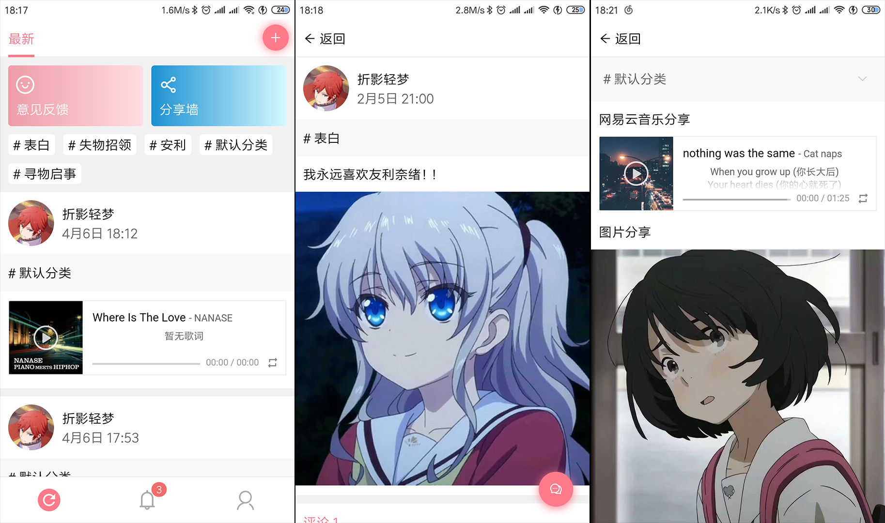

## 介绍
一个基于 Vue.js 的匿名表白墙轻量级小程序

## 作者
折影轻梦（Nexmoe），根据MIT许可证发布。

## Demo
- [https://wall.chainwon.com/](https://wall.chainwon.com/)
- 欢迎大家在 issue 或者 pull request 中添加你部署好的网站链接

## 屏幕截图 

## 环境准备
- 支持 PHP 的服务器，PHP7以上版本最佳
- 支持 Apache 的服务器

## 安装
- 新建数据库
- 新建表，命名为 wall
- 导入根目录初始数据库文件 `wall.sql`
- 编辑根目录 `config.php` 文件进行数据库信息配置

## PWA支持
service-wroker 已配置好了，只需要修改 `/static/manifest.json` 里面的内容即可

## 后续更新
就读高中，
star 以及 issue 是我更新的动力
欢迎加群 482634342 划水